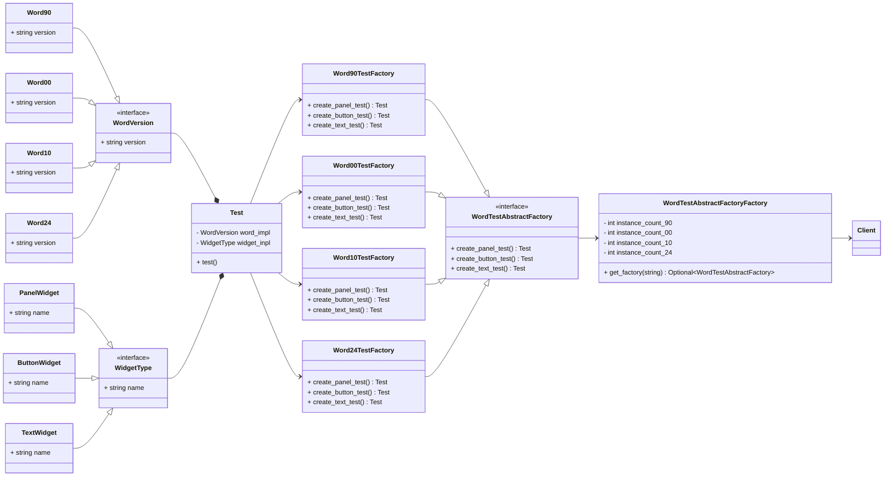

```mermaid
classDiagram
    direction RL

    %% High level
    Client <-- WordTestAbstractFactoryFactory
    WordTestAbstractFactoryFactory <-- WordTestAbstractFactory

    %% Implimentations
    WidgetType <|-- PanelWidget
    WidgetType <|-- ButtonWidget
    WidgetType <|-- TextWidget

    WordVersion <|-- Word90
    WordVersion <|-- Word00
    WordVersion <|-- Word10
    WordVersion <|-- Word24

    %% Abstraction
    Test *-- WordVersion
    Test *-- WidgetType

    %% Factories
    WordTestAbstractFactory <|-- Word90TestFactory
    WordTestAbstractFactory <|-- Word00TestFactory
    WordTestAbstractFactory <|-- Word10TestFactory
    WordTestAbstractFactory <|-- Word24TestFactory

    %% Relations
    Word90TestFactory <-- Test
    Word00TestFactory <-- Test
    Word10TestFactory <-- Test
    Word24TestFactory <-- Test

    class WordTestAbstractFactoryFactory {
        - int instance_count_90
        - int instance_count_00
        - int instance_count_10
        - int instance_count_24
        + get_factory(string) Optional~WordTestAbstractFactory~
    }

    class WordTestAbstractFactory {
         <<interface>>
        + create_panel_test() Test
        + create_button_test() Test
        + create_text_test() Test
    }

    class Test {
        - WordVersion word_impl
        - WidgetType widget_inpl
        + test()
    }

    class WordVersion {
        <<interface>>
        + string version
    }

    class WidgetType {
        <<interface>>
        + string name
    }

    class PanelWidget {
        + string name
    }

    class ButtonWidget {
        + string name
    }

    class TextWidget {
        + string name
    }

    class Word90 {
        + string version
    }

    class Word00 {
        + string version
    }

    class Word10 {
        + string version
    }

    class Word24 {
        + string version
    }

    class Word90TestFactory {
        + create_panel_test() Test
        + create_button_test() Test
        + create_text_test() Test
    }

    class Word00TestFactory {
        + create_panel_test() Test
        + create_button_test() Test
        + create_text_test() Test
    }

    class Word10TestFactory {
        + create_panel_test() Test
        + create_button_test() Test
        + create_text_test() Test
    }

    class Word24TestFactory {
        + create_panel_test() Test
        + create_button_test() Test
        + create_text_test() Test
    }
```