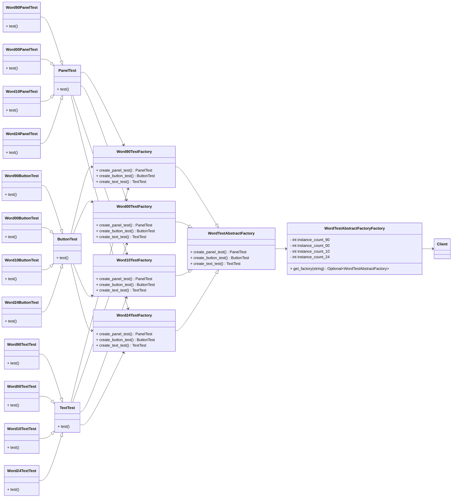

```mermaid
classDiagram
    direction RL

    %% High level
    Client <-- WordTestAbstractFactoryFactory
    WordTestAbstractFactoryFactory <-- WordTestAbstractFactory

    %% Test impls
    PanelTest <|-- Word90PanelTest
    ButtonTest <|-- Word90ButtonTest
    TextTest <|-- Word90TextTest

    PanelTest <|-- Word00PanelTest
    ButtonTest <|-- Word00ButtonTest
    TextTest <|-- Word00TextTest

    PanelTest <|-- Word10PanelTest
    ButtonTest <|-- Word10ButtonTest
    TextTest <|-- Word10TextTest

    PanelTest <|-- Word24PanelTest
    ButtonTest <|-- Word24ButtonTest
    TextTest <|-- Word24TextTest    

    %% Factories
    WordTestAbstractFactory <|-- Word90TestFactory
    WordTestAbstractFactory <|-- Word00TestFactory
    WordTestAbstractFactory <|-- Word10TestFactory
    WordTestAbstractFactory <|-- Word24TestFactory

    %% Relations
    Word90TestFactory <-- PanelTest
    Word90TestFactory <-- ButtonTest
    Word90TestFactory <-- TextTest

    Word00TestFactory <-- PanelTest
    Word00TestFactory <-- ButtonTest
    Word00TestFactory <-- TextTest

    Word10TestFactory <-- PanelTest
    Word10TestFactory <-- ButtonTest
    Word10TestFactory <-- TextTest

    Word24TestFactory <-- PanelTest
    Word24TestFactory <-- ButtonTest
    Word24TestFactory <-- TextTest

    class WordTestAbstractFactoryFactory {
        - int instance_count_90
        - int instance_count_00
        - int instance_count_10
        - int instance_count_24
        + get_factory(string) Optional~WordTestAbstractFactory~
    }

    class WordTestAbstractFactory {
        + create_panel_test() PanelTest
        + create_button_test() ButtonTest
        + create_text_test() TextTest
    }

    class PanelTest {
        + test()
    }

    class ButtonTest {
        + test()
    }

    class TextTest {
        + test()
    }

    class Word90TestFactory {
        + create_panel_test() PanelTest
        + create_button_test() ButtonTest
        + create_text_test() TextTest
    }

    class Word00TestFactory {
        + create_panel_test() PanelTest
        + create_button_test() ButtonTest
        + create_text_test() TextTest
    }

    class Word10TestFactory {
        + create_panel_test() PanelTest
        + create_button_test() ButtonTest
        + create_text_test() TextTest
    }

    class Word24TestFactory {
        + create_panel_test() PanelTest
        + create_button_test() ButtonTest
        + create_text_test() TextTest
    }

    class Word90PanelTest {
        + test()
    }

    class Word90ButtonTest {
        + test()
    }

    class Word90TextTest {
        + test()
    }

    class Word00PanelTest {
        + test()
    }

    class Word00ButtonTest {
        + test()
    }

    class Word00TextTest {
        + test()
    }

    class Word10PanelTest {
        + test()
    }

    class Word10ButtonTest {
        + test()
    }

    class Word10TextTest {
        + test()
    }

    class Word24PanelTest {
        + test()
    }

    class Word24ButtonTest {
        + test()
    }

    class Word24TextTest {
        + test()
    }
```